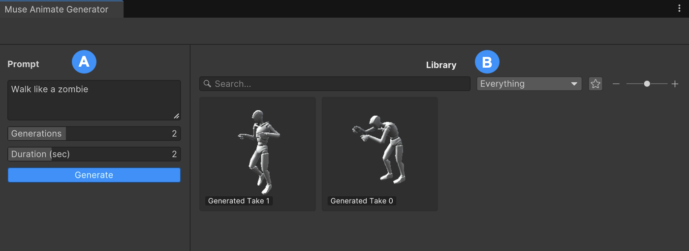

# Muse Animate interface

This section provides a detailed tour of the Muse Animate window.

| Component | Description |
| --------- | ----------- |
| **A**: **Prompt** | Specify various parameters and settings for your animation. Use this section to create new animation from scratch. | 
| **B**: **Library** | Store and manage all your saved animations. |

## Additional resources

* [Install Muse Animate with the Package Manager](install-animate.md)
* [Best practices for using Muse Animate](best-practice.md)