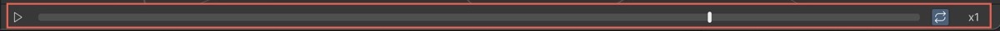

# Work with playback controls

When you select an animation from the **Library**, it opens in Muse Animate Generator's main pane. 

The playback controls in the editor are a visual representation of the sequence and duration of animations. Use these controls for animation playback.

**Play and pause animation**: Select the **Play** button to start the playback of your animation from the current playhead position. Select the **Pause** button to pause the animation at the current frame.

**Loop**: Select **Loop** to toggle the looping of the animation playback.

**Playback Speed**: Controls the rate at which Muse Animate plays the animation. The available playback speed options are:

* **x1**: This is the default playback speed, where the animation plays at its original speed.
* **x2**: This option doubles the playback speed.
* **x3**: This option triples the playback speed.
* **x0.25**: This option reduces the playback speed to a quarter of the original speed.
* **x0.5**: This option reduces the playback speed to half of the original speed.

## Additional resources

* [Get started with Muse Animate](get-started.md)
* [Generate animation](generate-animation.md)
* [Manage Library](library.md)