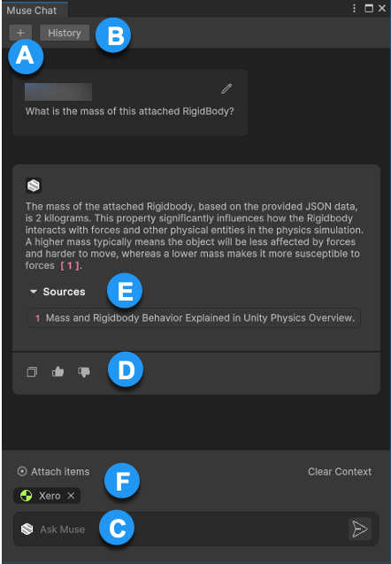

# Muse Chat Editor interface

This section provides a detailed tour of Muse Chat in the Unity Editor.

| Component | Description |
| --------- | ----------- |
| **A**: **+** |  Start a new conversation with Muse Chat. Use this feature start a new topic of discussion with Muse Chat or reset the current chat context. |
| **B**: **History** |  Refer to a log of your previous interactions within Muse Chat. Review and reuse previous information without having to retype or recall past conversations. |
| **C**: Text field | Enter your queries. Queries are the primary interaction point for communication with Muse Chat. By typing in questions, instructions, or topics of interest, you start the conversation and receive relevant responses from Muse Chat. |
| **D**:  **Additional features** |  Copy content to Clipboard and provide positive and negative feedback. |
| **E**: **Sources** | Refer to the original website, documents, articles, or data sets from which Muse Chat generates its response. |
| **F**: **Attach items** | Attach different types of assets, GameObjects, Console logs and errors, MonoBehaviour scripts, and other project-specific files. |

## Additional resources

* [Install Muse Chat with the Package Manager](install-chat.md)
* [Use Muse Chat Editor](use-editor-chat.md)
* [Best practices for using Muse Chat](best-practice-chat.md)