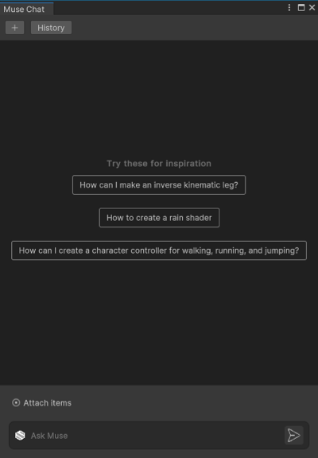

# Install Muse Chat with the Package Manager

To install Muse Chat with the Package Manager, perform the following steps:

1. In the main menu, go to **Window** > **Package Manager**.

    The Package Manager window opens.
2. To find the package, go to **Add** > **Add package by name**.
3. In **Name**, enter `com.unity.muse.chat`, then select **Add**.

   **Muse Chat** is listed under Package Manager's **In Project** > **Packages - Unity** section.

## Launch the tool

After you install Muse Chat, perform the following steps to launch the tool:

1. In the main menu, select **Muse** > **Chat**.
   The **Muse Chat** window opens.
2. When possible, dock the **Muse Chat** window. This keeps you from losing the window and launching it multiple times.

    

## Additional resources

* [Muse Chat Editor interface](editor-chat-interface.md)
* [Use Muse Chat Editor](use-editor-chat.md)
* [Best practices for using Muse Chat](best-practice-chat.md)