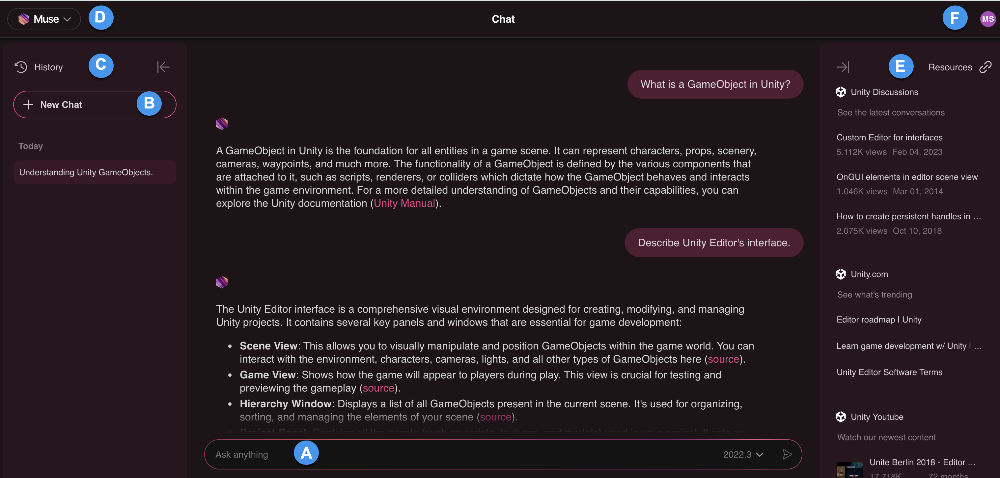

# Muse Chat web interface
This section provides a detailed tour of Muse Chat on the web and how to use it.

| Component | Description |
| --------- | ----------- |
| (**A**) | Text field is where you type your prompts or enter your queries. It functions as the primary interaction point for communication with Muse Chat. By typing in questions, instructions, or topics of interest, you start the conversation and receive relevant responses from Muse Chat. |
| (**B**) | **New Chat** allows you to start a new conversation with Muse Chat. This feature is useful when you want to begin a new topic of discussion or reset the current chat context. |
| (**C**) | **History** panel provides you with a log of your previous interactions with Muse Chat. It keeps track of all the past queries and responses, making it easier to reference or follow up on earlier conversations. It allows you to review and reuse previous information without having to retype or recall past conversations. |
| (**D**) | **Muse** dropdown lists all the Muse capabilities available to subscribers, such as Chat, Sprite, Texture, Animate, and Behavior. |
| (**E**) | **Resources** panel provides access to additional materials and documentation that enhances your understanding of the query you submitted to Muse Chat. It includes links to help articles, user guides, tutorials, and other relevant resources. |
| (**F**) | **User profile** icon enables you to access your Unity account. It provides access to your Unity organizations and allows you to view your subscription and Muse usage details. |

## Additional resources

* [Muse Chat features](features-chat.md)
* [Muse Chat web version](web-chat.md)