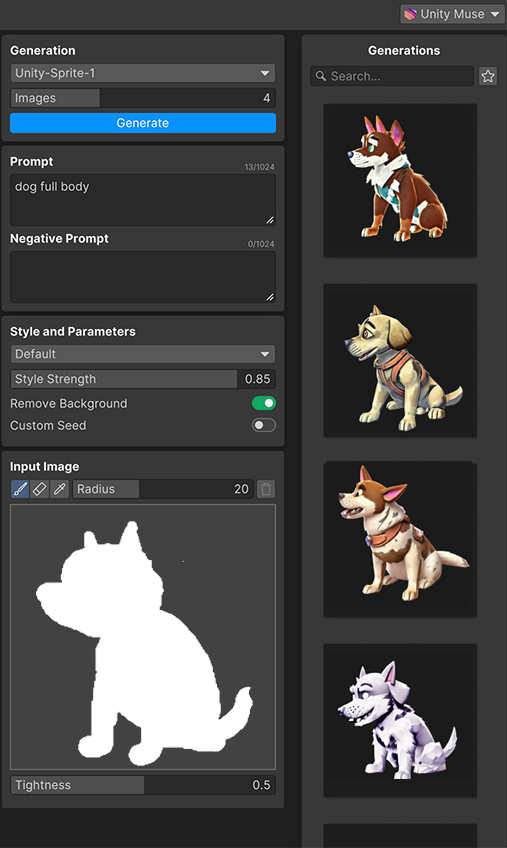

# Generate from a scribble

You can generate sprites from a scribble. A scribble is a rough drawing that describes the shape of the sprite you want to generate.

1. In the **Input Image** panel, select the **Scribble** tool.
1. To change the size of the scribble tool, press **[** or **]**.
1. Draw a scribble in the shape of the sprite you want to generate. For more information about the scribble tools, refer to [Input Image panel](xref:ui-elements#input-image-panel) reference.
1. To set the style strength, move the **Style Strength** slider. Higher values result in more closely aligned styles.
1. To set the likeness between the generated sprites and the scribble, move the **Tightness** slider. Higher values result in more alike sprites.
1. In the **Prompt** field, write a prompt that describes the sprite you want to generate.
1. To set the number of images to generate, move the **Images** slider.
1. If you don't want a background in the generated sprites, enable **Remove Background**.
1. Select **Generate**. The generated sprites appear in the **Generations** panel.

   

## Additional resources

* [Write a prompt](xref:write-prompt)
* [Refine with masking](xref:refine)