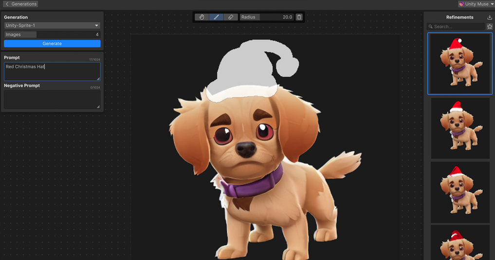

# Refine with masking

Masking provides enhanced control over the output. Use a mask to refine any part of a generated sprite. You can adjust the mask with brush settings and an eraser.

## Refine a sprite

Use a mask to refine any part of a generated sprite. Adjust the mask with brush settings and an eraser.

1. Hover your cursor over the sprite that you want to refine, and select the **Refine** icon to enter the Refinements branch.

   > [!TIP]
   > You can also double-click a generated sprite in the **Generations** panel to enter the Refinements branch.

1. To activate the masking brush, select the **Paint** icon. For more information about the masking tools, refer to [Refine panel](xref:ui-elements#refine-panel) reference and [Keyboard shortcuts](xref:keyboard-shortcuts#refine-panel).
1. Paint a mask over the area that you want to refine.
1. Enter a prompt that describes the desired refinement.
1. Select **Generate**. This regenerates subjects in the masked area.

   

> [!TIP]
> You can also double-click a generated sprite in the **Generations** panel to enter the Refine mode.

## Set as thumbnail

To set a refined sprite as the thumbnail in the **Generations** panel for the Refinements branch, in the **Refinements** panel, right-click the sprite and select **Set as Thumbnail**.

To re-enter the Refinements branch from the  **Generations** panel, double-click the thumbnail.

## Create a new refinement branch

To create a new refinement branch from a refined sprite, in the **Refinements** panel, right-click the sprite and select **Branch**. This adds the selected sprite to the **Generations** panel and creates a new refinement branch with the selected sprite as the root.

## Additional resources

* [Write a prompt](xref:write-prompt)
* [Generate sprites](xref:generate)
* [Tool reference](xref:tool-reference)