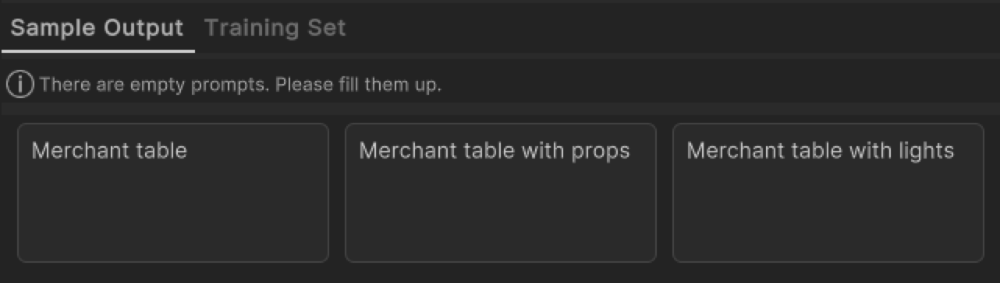
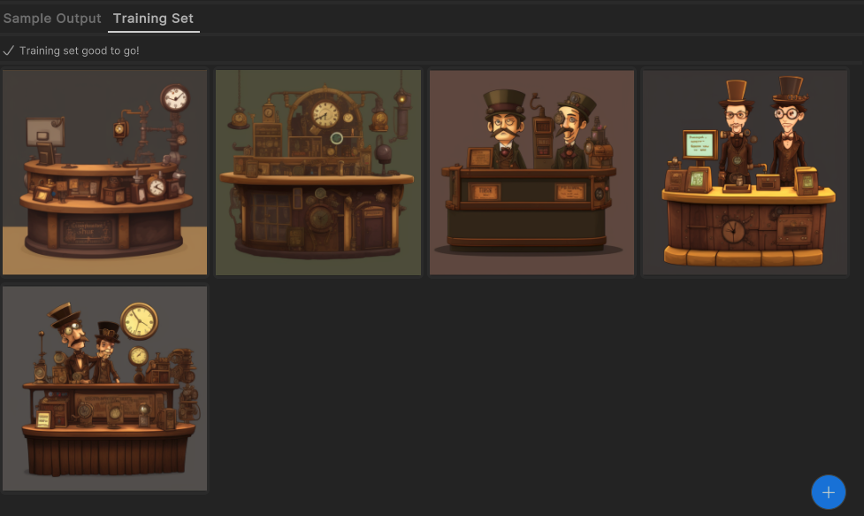
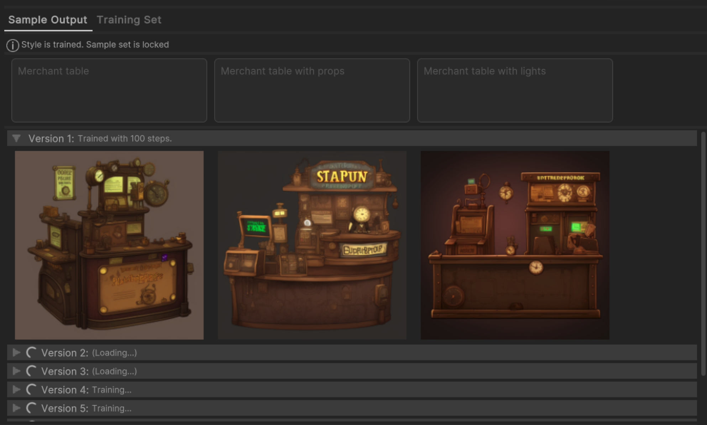
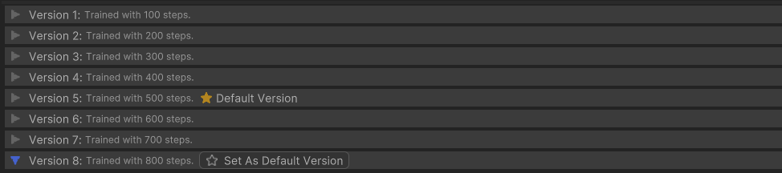
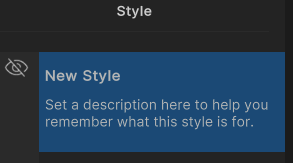

# Style trainer

When you generate sprites, you can use a style to influence the look of the generated sprites. The Muse Sprite tool provides several default styles to generate sprites based on them. You can also train your own styles.

## Create a style

1. In Unity, from the menu, select **Muse** > **Style Trainer**.
1. Select the **Add (+)** button on the bottom left to create a new style.
1. Enter a name and description for your style.

## Train a style

To train your own styles, use Style Trainer to set the sample output prompts and training images:

- Sample output prompts serve as a validation to showcase the result of the prompt. At least three and no more than five prompts are required.
- Training images are reference images to indicate the style that you want. To train a style, at least five and no more than 15 reference images are required.

1. In the **Style** panel, select the style you want to train.
1. In the **Sample Output** tab, enter the sample output prompts.

    > [!NOTE]
    > You can't enter duplicated prompts for sample output.

    
1. To add a new sample prompt field, select the **Add (+)** button.
1. To delete a sample prompt field, hover over a field and select the **Delete** icon.
1. Select the **Training Set** tab.
1. To add reference images, select the **Add (+)** button.

    > [!NOTE]
    > <ul><li>You can't add duplicated images. </li><li> Image size must be between `128 x 128` and `512 x 512` pixels. Images that are smaller or larger than the value are resized automatically.</li><li> Use of an alpha channel in an image isn't supported. Any alpha channel information are automatically removed.</li></ul>

    
1. Select **Generate Style**. 

## Validate a style

After training, the style trainer generates eight versions of the trained style, each generated with 100 training step increments. In this sequence, version 1 is trained for 100 steps, version 2 for 200 steps, and version 8 for 800 steps.

Each version is generated with the sample output images for the sample prompts. You can validate if the style is good for style generation.

> [!NOTE]
> You can't change the sample output prompts or the reference images once a style version is trained.

## Use a style in Muse Sprite Generator

To use a style, when you generate sprites in Muse Sprite Generator, select the style from the **Style and Parameters** list.

## Use a specific version of a style

By default, the latest version is used. To use a specific version of the style, select **Set As Default Version**.

## Duplicate a style

If you want to start a new style with the current training images and sample output prompts, select **Duplicate Style** in the **Style Trainer** window.

## Hide a style

To hide a style from showing in the Muse Sprite Generator's **Style** list, select the **Hide** icon in the **Style Trainer** window.

## Delete a style

To delete a style, hover over the style and select the **Delete** icon in the **Style Trainer** window. This deletes the style from the server.

> [!NOTE]
> You can only delete styles that aren't trained.

## Additional resources

* [Generate sprites](xref:generate)
* [Refine with masking](xref:refine)